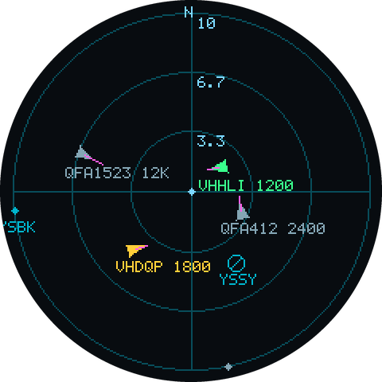
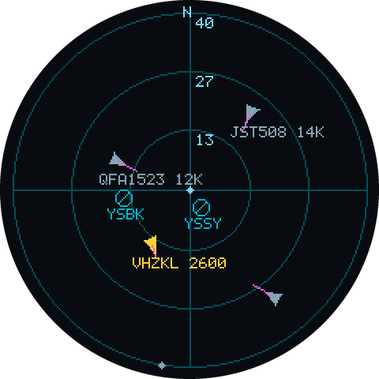

# ESP32 Plane Radar

A round-LCD "plane radar" for the ESP32-WROOM-32 + Waveshare 1.28" GC9A01 display. It
centres on your configured location and shows live aircraft (from the free
[adsb.fi](https://opendata.adsb.fi) ADS-B feed) as colour-coded triangles with heading and
speed vectors, plus nearby airports as static markers.

Inspired by [MatixYo/ESP32-Plane-Radar](https://github.com/MatixYo/ESP32-Plane-Radar),
adapted to the WROOM-32 (dual-core ESP32) and extended with aircraft classification by type
and a boot-time connection-info screen.

<p align="center">
  
  &nbsp;&nbsp;
  
</p>
<p align="center"><em>10 km and 40 km ranges. Grey = commercial, amber = VFR/GA, green = helicopter;
magenta lines are ground-speed vectors, cyan marks airports.</em></p>

These are rendered from the actual `src/ui/` render code compiled on the host against a
small canvas shim, not mocked up — so they are pixel-accurate to the panel. Regenerate with
`tools/render_preview/render.sh`.

## Features

- Live aircraft within a selectable range, polled every 5 s.
- **Colour by aircraft class:** VFR/GA (amber), helicopter (green), commercial (grey).
  Uncategorised traffic falls into the commercial bucket rather than being guessed at.
- Heading triangle + magenta ground-speed vector. Distance-gated callsign+altitude tags
  (shown only inside the 2nd ring, so a busy sky stays readable).
- Adaptive airport markers (runway glyph inside range, rim tick outside). Ships with YSSY
  (Sydney) and YSBK (Bankstown).
- Range presets cycled by the BOOT button: **5 / 10 / 25 / 40 km**, defaulting to 10 km.
  Each ring is labelled with its distance along the north axis.
- Range changes are instant — the cached aircraft are rescaled and redrawn without
  re-fetching, because every poll requests the widest preset.
- WiFi + location via a captive portal — no recompiling to move it.
- Boot-time info screen showing the DHCP-assigned IP, then auto-advancing to the radar
  after 15 s so a power-cycle needs no button press. Re-checkable any time.

## Hardware & Wiring

ESP32-WROOM-32 + Waveshare 1.28" GC9A01 (240×240 round SPI LCD).

| Display pin | ESP32 GPIO | Notes                    |
|-------------|-----------:|--------------------------|
| VCC         | 3V3        |                          |
| GND         | GND        |                          |
| DIN (MOSI)  | 23         | hardware VSPI MOSI       |
| CLK (SCLK)  | 18         | hardware VSPI SCLK       |
| CS          | 15         |                          |
| DC          | 2          |                          |
| RST         | 4          |                          |
| BL          | 22         | PWM backlight (LEDC)     |
| —           | BOOT (0)   | onboard button           |

Pins are defined in [`include/config.h`](include/config.h).

## Build & Flash

Requires [PlatformIO](https://platformio.org/).

```bash
# Build firmware
pio run -e esp32dev

# Flash (board on /dev/cu.usbserial-0001 — edit upload_port in platformio.ini if different)
pio run -e esp32dev -t upload

# Serial monitor
pio device monitor -b 115200
```

The `espressif32` platform is pinned to 6.11.0 (Arduino core 2.0.17, which still has the
`ledcSetup`/`ledcAttachPin` API) and the PlatformIO core directory is kept inside the project
at `.pio-core/`. Both are deliberate — see the comments in
[`platformio.ini`](platformio.ini) before changing them.

### Flashing gotchas

Two hardware issues cost hours during bring-up. Both present as "the toolchain is broken"
when they are not:

- **Disconnect the display's 3V3 before flashing.** With the panel powered, the SPI flash
  browns out during init: `esptool` connects and identifies the chip, then fails with
  `FlashID=0x0` / "Serial data stream stopped: Possible serial noise or corruption". With
  display VCC unplugged the same command succeeds first time.
- **Use a real data cable, straight into the host.** A power-only cable produces *no*
  `/dev/cu.*` device at all, so there is nothing to upload to — the board still lights up,
  which makes this misleading. A working setup enumerates as `CP2102 USB to UART Bridge
  Controller`.

## Tests

Pure logic (classification, projection, unit conversion, geo math, button FSM, JSON parsing)
is unit-tested off-device on the host:

```bash
pio test -e native
```

39 test cases across 7 suites. No hardware required.

## First-Run Setup

1. Flash and power the board. A **"PLANE RADAR / starting..."** splash appears.
2. On first boot the ESP32 opens a WiFi hotspot **`PlaneRadar-setup`**. Connect with your
   phone; a captive portal opens. The panel shows the network name and portal address.
3. Enter your WiFi credentials and your **Latitude / Longitude** (the radar's centre point).
   Saved to NVS — you won't be asked again.
4. The **Info screen** shows the assigned IP, SSID, and your coordinates.
5. Press **BOOT** to enter the radar, or just wait 15 s.

If WiFi was never configured, the info screen shows "No WiFi / hold BOOT to setup" and stays
put rather than advancing.

## Button Gestures (BOOT / GPIO0)

There is no double-press gesture; the three events are distinguished purely by hold duration.

| Gesture             | In Radar                              | On Info screen |
|---------------------|---------------------------------------|----------------|
| Short press         | Cycle range 10 → 25 → 40 → 5 km       | Start radar    |
| Hold ≥ 1.5 s        | Peek Info screen (auto-returns 5 s)   | —              |
| Hold ≥ 8 s          | Wipe config + reopen captive portal   | (same)         |

A hold long enough to reset fires the peek at 1.5 s on the way through, so the info screen
appearing is the visual cue that you are holding it down.

## Display Legend

| Symbol | Meaning |
|--------|---------|
| 🔺 amber | VFR / general aviation (category A1, or a light type such as C172) |
| 🔺 green | Helicopter (category A7, or a rotor type such as R44) |
| 🔺 grey | Commercial (A2–A5) and any aircraft with no reported category |
| dot | Aircraft outside the outermost ring |
| magenta line | Ground-speed vector |
| cyan ⊘ / tick | Airport (glyph inside range, rim tick outside) |
| blue dot | You (centre) |

Ground vehicles and surface objects (categories B*/C*, and anything reporting
`alt_baro: "ground"`) are filtered out.

## Project Layout

```
include/config.h            pins, ranges, colours, API host, timings
src/model/                  aircraft+classify, units, geo (pure, host-tested)
src/ui/projection.*         coordinate projection + ring/tag gating (pure, host-tested)
src/data/airports.*         static airport table
src/services/adsb_parse.*   JSON parser (pure, host-tested)
src/services/adsb_client.*  HTTPS fetch (device)
src/hardware/               display driver, button FSM
src/net/wifi_setup.*        captive portal + NVS
src/ui/radar_render.*       rings / aircraft / airport rendering
src/ui/screens.*            splash / portal / info screens
src/main.cpp                splash → info → radar state machine
test/native/                Unity unit tests
tools/render_preview/       host-side renderer for the README screenshots
```

## Memory Notes

The WROOM-32 has no PSRAM, and this firmware runs close to both limits — worth knowing
before adding features:

- The offscreen canvas is an **8-bit palette sprite** (57.6 KB) rather than 16-bit
  (115.2 KB), because the largest contiguous free block is only ~110 KB. In palette mode the
  LovyanGFX primitives take a palette *index* as their colour, which is why `COL_*` are
  indices and `RADAR_PALETTE` maps them to RGB565.
- The ADS-B response is **stream-parsed straight off the socket** with a key filter, never
  buffered as a whole. Buffering it (`getString()` plus a `std::string` copy) needed ~60 KB
  of transient heap for a ~30 KB body, which does not fit in the largest free block once the
  TLS buffers have fragmented the heap — the result was a `std::bad_alloc` abort and a reboot
  loop on every poll. Keep the filter in
  [`adsb_parse.cpp`](src/services/adsb_parse.cpp) in sync with the fields the renderer uses.
- Flash is at ~89% of the partition.

The blocking HTTPS poll runs in its own 12 KB task pinned to core 0, so the render loop and
button polling stay responsive on core 1; a button press is never swallowed by an in-flight
network request.

## Changing the Airport List

Airports are a static table in [`src/data/airports.cpp`](src/data/airports.cpp)
(large/medium ICAO airports near home). To cover a different area, regenerate it from the
[OurAirports](https://ourairports.com/data/) dataset — filter to `large_airport`/
`medium_airport` with an `ident` within range of your location.
